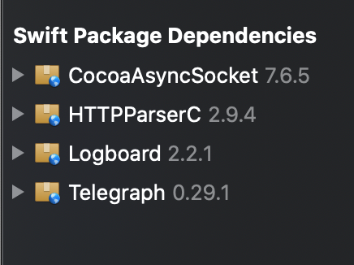

## Guidance

This is ios repositorie for NeuralRecon, futher user guidance please refer to https://github.com/Burningdust21/NeuralRecon/tree/webcam

## Installation

1. Clone the project, open with Xcode 12.

2. Wait a while for xcode to load swift packages, it should be lokking like this:

   

3. insert your developer certifaction into the following targets:

   - NeuralRecon

     

   - ScreenCast

     

4. Install it to you iPhone/Ipad

   

## UI introduction 

1. Recording interface

   

   ① Switch to Preference interface

   ② Switch to Preference interface

   ③ Actual publishing video frames resolution after encoding

   ④ Video frames capturing resolution

   ⑤ Start/end recording button

   ⑥ Publishing frame rate. If it is 0, it means that something is wrong, check your networks, or use lower sending resolution.

2. Preperence interface

   ① Switch to Recording interface

   ② Switch to Preference interface

   ③ RTMP server address

   ④ Stream name 

   ⑤ Select the video frame resolution supported by the device. Shown in brackets are the number of different resolutions supported by the device for video recording. N options available means that there are N resolutions to choose from, corresponding to serial numbers [0, N-1]. After changing, press Enter to confirm, and you can view the selected resolution in ④ on the Recording interface.

   ⑥ The ratio of video frame size compression during encoding. Decrease the original resolution by the scale factor, and get the actual resolution as ③ of the Recording interface. If the scale factor is too small, that is, the resolution after encoding is closer to the original resolution, transmission errors may occur.

**NOTE:  press enter after keyboard input to commit changes in test boxes** 

- Make sure sender and receiver are connected to the server.

